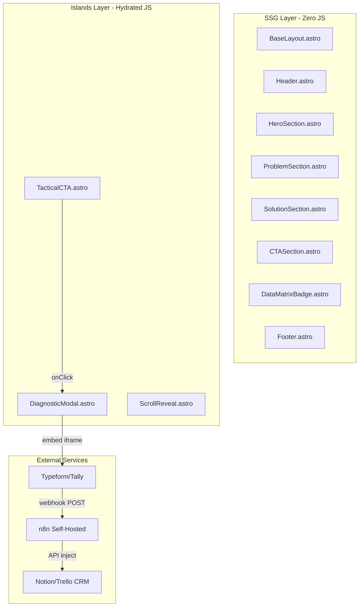

# Architecture Decision Document

_This document builds collaboratively through step-by-step discovery. Sections are appended as we work through each architectural decision together._

## Project Context Analysis

### Requirements Overview

**Functional Requirements:**
- 3 categorias: Conteúdo & Navegação (FR1-FR3), Captura Qualificada (FR4-FR7), Automação Backend (FR8-FR9)
- A SPA é essencialmente um "funil narrativo vertical" com um único objetivo de conversão: Lead → Formulário Diagnóstico → Webhook → CRM
- A complexidade funcional reside na integração impecável do embed Typeform/Tally como modal imersivo e no disparo confiável do webhook para n8n

**Non-Functional Requirements:**
- NFR1-NFR4: Performance extrema (Lighthouse ≥ 95, LCP ≤ 2.0s, TTFB ≤ 250ms, lazy loading de scripts terceiros)
- NFR5-NFR6: Reliability (SLA 99.9%, tolerância a picos de 10-20 webhooks simultâneos)
- NFR7-NFR8: Design System (Dark Mode rigoroso, WCAG 2.1 AA)

**UX/UI Architectural Implications:**
- Islands Architecture (Astro): 90% HTML/CSS estático renderizado no servidor, JS hidratado apenas no modal do formulário
- Animações exclusivamente CSS nativas (IntersectionObserver + CSS transitions), zero libs JS de animação
- Font strategy: subsetting de Inter e JetBrains Mono com preload, swap display para preservar LCP
- Modal Diagnóstico: backdrop-blur, body scroll lock via JS mínimo, focus trap para a11y

**Scale & Complexity:**
- Primary domain: web_app (Landing Page SPA / SSG)
- Complexity level: Low
- Estimated architectural components: ~8 (Layout, Hero, Problem Section, Solution Section, CTA Button, Diagnostic Modal, Footer, Webhook Integration)

### Technical Constraints & Dependencies

**Framework & Tooling (Pré-definidos):**
- Astro (Islands Architecture) — SSG first, hydration seletiva
- TailwindCSS — utility-first com tokens no config (sem CSS custom descontrolado)
- Cloudflare Pages — deploy edge com CDN global

**Integrações Externas:**
- Typeform ou Tally — formulário embedado (iframe responsive ou JS SDK lazy-loaded)
- n8n (Self-Hosted) — receptor de webhook para pipeline de lead qualification
- CRM Target (Notion/Trello) — destino final do payload qualificado

**Supabase/PostgreSQL (Planejamento Futuro):**
- MVP: Opcional (persistência de leads pode ser feita diretamente pelo n8n → CRM)
- Phase 2+: Supabase como banco central para analytics de leads, estudos de caso, e calculadoras ROI
- Design desde o início seguindo best practices: bigint identity PKs, timestamptz, RLS policies, connection pooling, indexes em FKs

**LGPD & Privacidade:**
- Coleta de dados pessoais (nome, email, empresa) via formulário — requer consentimento explícito
- Política de privacidade acessível no footer
- Dados transmitidos via HTTPS (TLS) obrigatório em todos os endpoints

### Cross-Cutting Concerns Identified

1. **Performance Budget:** Cada decisão (font, image, script, animation) deve ser validada contra o budget de Lighthouse ≥ 95 e LCP ≤ 2.0s
2. **Acessibilidade (WCAG 2.1 AA):** Focus rings, contrast rules, prefers-reduced-motion, aria-labels em todos os componentes interativos
3. **SEO & Social Sharing:** Meta tags, OG tags, structured data (Organization schema), sitemap.xml, robots.txt
4. **LGPD Compliance:** Banner de consentimento, política de privacidade, transmissão segura de dados
5. **Dark Mode Consistency:** Paleta Zinc única (sem toggle light/dark) aplicada uniformemente — sem desvios de cor

## Starter Template Evaluation

### Primary Technology Domain

Web Application (SSG/Landing Page) — SPA estática com hidratação seletiva (Islands Architecture), deploy edge via Cloudflare Pages.

### Starter Options Considered

| # | Starter | Versão | Avaliação |
|---|---|---|---|
| 1 | **`create astro` (Minimal)** | Astro 5.18 + Tailwind v4 | ⭐ **Selecionado** — Máximo controle, zero overhead |
| 2 | AstroWind | Astro 5 + Tailwind | ❌ Excessivo (blog, múltiplas páginas, componentes desnecessários) |
| 3 | Astroship | Astro + Tailwind | ❌ Design genérico, conflita com Brutalismo Dark |
| 4 | Astro Starter Pro | Astro 5 + Tailwind v4 | ❌ Blog, light/dark toggle — conflita com mono-dark |
| 5 | ryotahagihara/astro-tailwind-starter | Astro v5 + Tailwind v4 | ⚠️ Viável, porém desnecessário vs CLI oficial |

### Selected Starter: Astro CLI (Minimal) + Tailwind v4 Integration

**Rationale for Selection:**
- Máximo controle sobre cada decisão de design (alinhado ao UX Spec "Custom Design System")
- Zero overhead — sem componentes, páginas ou estilos para deletar
- Astro 5.18 (stable) com suporte nativo a Tailwind CSS v4 via `@tailwindcss/vite`
- Cloudflare Pages deployment pronto desde o início (adapter oficial)
- TypeScript Strict mode desde a criação
- Templates prontos trabalham contra o projeto por trazerem design systems conflitantes

**Initialization Command:**

```bash
npm create astro@latest ./ -- --template minimal --typescript strict --install --git
```

**Post-initialization integrations:**

```bash
npx astro add tailwind
npx astro add cloudflare
npx astro add sitemap
```

**Architectural Decisions Provided by Starter:**

**Language & Runtime:**
- TypeScript (Strict mode) — type safety total
- Node.js runtime para build, Cloudflare Workers/Pages para deploy

**Styling Solution:**
- Tailwind CSS v4 via `@tailwindcss/vite` plugin
- CSS-first configuration (configuração diretamente no CSS via `@import "tailwindcss"`)
- PurgeCSS embutido automaticamente — apenas classes usadas no bundle

**Build Tooling:**
- Vite (embutido no Astro) — hot reloading instantâneo
- Static Site Generation (SSG) como output padrão
- Astro Optimizer para compressão de HTML/CSS

**Testing Framework:**
- Não incluído no starter minimal (adicionado sob demanda)
- Recomendação: Playwright para E2E Lighthouse testing

**Code Organization:**

```
src/
├── components/     # .astro components (Button, Modal, Badge, etc.)
├── layouts/        # BaseLayout.astro (head, fonts, meta)
├── pages/          # index.astro (SPA única)
├── styles/         # global.css (Tailwind imports + tokens)
└── assets/         # SVGs, imagens otimizadas
public/
├── favicon.svg
└── robots.txt
```

**Development Experience:**
- `astro dev` — servidor local com HMR
- `astro build` — build estático para Cloudflare Pages
- `astro preview` — preview local do build de produção

**Note:** Project initialization using this command should be the first implementation story.

## Core Architectural Decisions

### Decision Priority Analysis

**Critical Decisions (Block Implementation):**
- Framework, Language, Styling, Deploy Platform → Já decididos (Astro 5.18 + TS Strict + Tailwind v4 + Cloudflare Pages)
- Database Strategy → Supabase no Phase 2 (schema desenhado agora)
- Webhook Integration Pattern → Typeform Native Webhook direto para n8n
- Component Hydration Strategy → Islands Architecture (JS apenas no DiagnosticModal e ScrollReveal)

**Important Decisions (Shape Architecture):**
- Font Loading Strategy → Self-hosted com preload + swap
- Image Optimization → Astro Image component + SVGs inline
- CI/CD Pipeline → GitHub Actions → Cloudflare Pages
- LGPD Compliance → Consentimento no form + Política de Privacidade estática

**Deferred Decisions (Post-MVP):**
- Supabase schema implementation (Phase 2)
- Cloudflare Worker proxy para webhooks (Phase 2)
- Advanced analytics (heatmaps, session recordings)
- E2E testing com Playwright

### Data Architecture

**Decision: No Database no MVP — Supabase Schema Designed for Phase 2**
- Rationale: MVP é uma landing page estática. O fluxo de dados é Typeform → webhook → n8n → CRM. Zero necessidade de banco no frontend.
- Phase 2: Supabase (PostgreSQL managed) será introduzido para analytics de leads, estudos de caso e calculadoras ROI.
- Schema design seguindo Supabase/Postgres best practices desde agora:

```sql
-- Schema planejado para Phase 2 (Supabase)
-- Seguindo best practices: bigint identity PKs, timestamptz, text ao invés de varchar

create table leads (
  id bigint generated always as identity primary key,
  email text not null,
  name text not null,
  company text,
  role text,
  pain_points text,
  tools_count int,
  team_size text,
  source text default 'landing_page',
  typeform_response_id text unique,
  qualified boolean default false,
  created_at timestamptz default now(),
  updated_at timestamptz default now()
);

-- Index on frequently queried columns
create index leads_email_idx on leads (email);
create index leads_created_at_idx on leads (created_at);
create index leads_qualified_idx on leads (qualified) where qualified = true;

-- RLS for future multi-tenant support
alter table leads enable row level security;
```

- Connection pooling via PgBouncer (Supabase built-in) em transaction mode
- Dados vetoriais (pgvector) reservados para Phase 3 (Portal de Governança com RAG)

### Authentication & Security

**Decision: Webhook Security — Header Token (Bearer)**
- n8n endpoint protegido por `Authorization: Bearer <token>` fixo
- Token armazenado como environment variable no Typeform e no n8n
- Suficiente para MVP (baixo volume, endpoint não exposto publicamente)
- Migração para HMAC Signature no Phase 2 se volume aumentar

**Decision: LGPD Compliance — Consentimento Explícito**
- Checkbox obrigatório no formulário Typeform/Tally: "Aceito a Política de Privacidade"
- Página estática `/privacidade` (ou seção no footer) com política de privacidade
- Dados pessoais transmitidos exclusivamente via HTTPS (TLS — garantido por Cloudflare + Typeform)
- Banner de cookies apenas se analytics com cookies for implementado (GA4). Cloudflare Analytics é cookieless.
- Nenhuma autenticação de usuário necessária (site público)

### API & Communication Patterns

**Decision: Typeform Native Webhook → n8n**
- Padrão: Typeform dispara webhook HTTP POST automaticamente para URL do n8n após cada submission
- Payload: JSON com todas as respostas do formulário
- Retry: Typeform possui retry automático built-in em caso de falha
- Error Handling: n8n Error Workflow notifica via Slack/Email se o processamento falhar
- Zero JS custom no frontend para a integração

**Decision: Error Handling Strategy**
- Frontend: Nenhum error handling custom (Typeform/Tally cuida da UX de erro do formulário)
- Backend (n8n): Error Workflows centralizados com notificações para equipe
- Webhook failures: Retry automático do Typeform + Dead Letter Queue no n8n
- Sem feedback real-time para o usuário sobre status do webhook (desnecessário — tela de sucesso é estática)

### Frontend Architecture

**Decision: Component Strategy — Astro Islands (Zero-JS Default)**

| Componente | Hydration | Justificativa |
|---|---|---|
| `BaseLayout.astro` | Nenhum | Layout estático (head, meta, fonts) |
| `Header.astro` | Nenhum | Logo + CTA (HTML/CSS puro) |
| `HeroSection.astro` | Nenhum | Headline + subtext (HTML/CSS) |
| `ProblemSection.astro` | Nenhum | Conteúdo "Voo Cego" (HTML/CSS) |
| `SolutionSection.astro` | Nenhum | Método Aptus (HTML/CSS) |
| `TacticalCTA.astro` | Nenhum | Botão com CSS transitions |
| `DiagnosticModal.astro` | **`client:visible`** | JS para: open/close, focus trap, body scroll lock, Typeform embed lazy load |
| `DataMatrixBadge.astro` | Nenhum | Badge com font mono (HTML/CSS) |
| `ScrollReveal.astro` | **`client:visible`** | IntersectionObserver para fade-in animations |
| `Footer.astro` | Nenhum | Links, política privacidade (HTML/CSS) |

**Decision: Font Loading — Self-Hosted + Preload**
- Fontes servidas localmente (sem Google Fonts CDN — elimina request externo)
- `@fontsource/inter` e `@fontsource/jetbrains-mono` via npm
- Preload das variantes críticas: Inter 400, Inter 600, Inter 700
- `font-display: swap` para evitar FOIT
- Subsets: `latin` + `latin-ext` apenas

**Decision: Image Optimization — Astro Image**
- Componente `<Image />` do Astro para otimização automática (WebP/AVIF, responsive srcsets)
- SVGs inline para logo e ícones (zero HTTP requests adicionais)
- Lazy loading nativo (`loading="lazy"`) para imagens below-the-fold
- Nenhuma imagem de stock — gráficos vetoriais e tipografia como elementos visuais primários

**Decision: Animation Strategy — CSS Native Only**
- Zero bibliotecas JS de animação (sem Framer Motion, GSAP, etc.)
- IntersectionObserver + CSS `@keyframes` para scroll reveal
- CSS `transition` (150-200ms, ease-out) para hover/focus states
- `@media (prefers-reduced-motion: reduce)` para desabilitar animações

### Infrastructure & Deployment

**Decision: CI/CD — GitHub Actions → Cloudflare Pages**
- Push para `main` → build automático → deploy em produção
- Push para `preview/*` → preview deployment (Cloudflare Pages built-in)
- Pipeline: lint → build → Lighthouse CI check → deploy
- Lighthouse CI como gate: build falha se score < 95

**Decision: Environment Configuration**
- `.env` local para desenvolvimento (webhook URLs de teste, analytics IDs)
- Cloudflare Pages environment variables para produção
- Zero segredos sensíveis no frontend (tudo é SSG público)
- Variáveis de ambiente do n8n gerenciadas separadamente (fora do escopo da LP)

**Decision: Monitoring & Analytics**
- **Primary:** Cloudflare Web Analytics (built-in, cookieless, zero JS — não impacta Lighthouse)
- **Secondary (lazy-loaded):** Google Analytics 4 ou Plausible — carregado apenas on-interaction para preservar performance budget
- **Performance:** Lighthouse CI no GitHub Actions para guardar regression de scores
- **Uptime:** Cloudflare Pages SLA 99.9% (built-in)

**Decision: Scaling Strategy**
- Frontend: Cloudflare Pages (CDN edge global) — escala automaticamente, zero config
- Backend (n8n): Fora do escopo desta arquitetura (gerenciado separadamente com Queue Mode + Redis)
- Não há necessidade de auto-scaling, load balancers ou containers para a Landing Page

### Decision Impact Analysis

**Implementation Sequence:**
1. Inicializar projeto Astro (CLI minimal + integrations)
2. Configurar TailwindCSS v4 (tokens, paleta Zinc, tipografia)
3. Criar BaseLayout (head, fonts preload, meta tags, OG tags)
4. Implementar seções estáticas (Hero, Problem, Solution)
5. Criar componentes interativos (TacticalCTA, DiagnosticModal)
6. Integrar Typeform/Tally embed (lazy loaded)
7. Configurar webhook Typeform → n8n
8. Deploy Cloudflare Pages + CI/CD
9. Validar Lighthouse ≥ 95 e WCAG 2.1 AA

**Cross-Component Dependencies:**
- DiagnosticModal depende de: TacticalCTA (trigger), Typeform embed (conteúdo), ScrollReveal (animação de entrada)
- BaseLayout afeta todos: fonts, meta tags, CSS global
- TailwindCSS config (tokens) afeta todos os componentes visuais
- Cloudflare Pages config afeta CI/CD e environment variables

## Implementation Patterns & Consistency Rules

### Pattern Categories Defined

**Critical Conflict Points Identified:** 12 áreas onde agentes IA poderiam fazer escolhas diferentes

### Naming Patterns

**Database Naming (Schema Supabase — Phase 2):**
- Tabelas: `snake_case`, plural → `leads`, `page_visits`
- Colunas: `snake_case` → `created_at`, `team_size`
- PKs: `id` (sempre `bigint identity`)
- FKs: `{tabela_referenciada_singular}_id` → `lead_id`
- Indices: `{tabela}_{coluna}_idx` → `leads_email_idx`
- Constraints: `{tabela}_{coluna}_{tipo}` → `leads_email_unique`

**Code Naming (Astro + TypeScript):**
- Componentes Astro: **PascalCase** → `HeroSection.astro`, `TacticalCTA.astro`
- Arquivos de utilidade: **camelCase** → `scrollReveal.ts`, `focusTrap.ts`
- Variáveis/Funções TS: **camelCase** → `const isModalOpen`, `function toggleModal()`
- Constantes globais: **UPPER_SNAKE** → `const WEBHOOK_URL`
- Tipos/Interfaces TS: **PascalCase** → `interface LeadPayload`
- CSS classes (Tailwind custom): **kebab-case** → `.tactical-cta`, `.data-badge`

**File Naming:**
- Componentes: `PascalCase.astro` → `DiagnosticModal.astro`
- Layouts: `PascalCase.astro` → `BaseLayout.astro`
- Pages: `kebab-case.astro` → `index.astro`, `privacidade.astro`
- Styles: `kebab-case.css` → `global.css`
- Assets/SVG: `kebab-case.svg` → `logo-aptus.svg`

### Structure Patterns

**Project Organization (por tipo):**

```
src/
├── components/
│   ├── sections/        # Seções da página
│   │   ├── HeroSection.astro
│   │   ├── ProblemSection.astro
│   │   └── SolutionSection.astro
│   ├── ui/              # Componentes UI reutilizáveis
│   │   ├── TacticalCTA.astro
│   │   ├── DataMatrixBadge.astro
│   │   └── DiagnosticModal.astro
│   └── layout/          # Componentes estruturais
│       ├── Header.astro
│       └── Footer.astro
├── layouts/
│   └── BaseLayout.astro
├── pages/
│   ├── index.astro
│   └── privacidade.astro
├── styles/
│   └── global.css
├── scripts/             # JS para Islands (hydrated components)
│   ├── modal.ts
│   └── scrollReveal.ts
└── assets/
    ├── images/
    └── icons/
public/
├── favicon.svg
├── robots.txt
└── og-image.png
```

**Regras de Organização:**
- Um componente por arquivo (nunca exportar múltiplos componentes)
- Scripts JS vivem em `src/scripts/` e são importados via `<script>` nos componentes `.astro`
- Nenhum `.ts` ou `.js` dentro de `components/`
- Imagens processadas pelo Astro em `src/assets/`; estáticas puras em `public/`

### Format Patterns

**Tailwind CSS Class Ordering (obrigatório):**
1. Layout (flex, grid, position)
2. Spacing (p, m, gap)
3. Size (w, h, max-w)
4. Typography (text, font, tracking)
5. Colors (bg, text-color, border-color)
6. Effects (opacity, shadow, blur)
7. Transitions/Animations (transition, duration)
8. States (hover:, focus:, active:)
9. Responsive (sm:, md:, lg:)

**Data Exchange (Webhook Payload):**
- JSON com `snake_case` para chaves → `{ "lead_name": "...", "company_size": "..." }`
- Datas em ISO 8601 UTC → `"2026-03-02T14:25:00Z"`
- Booleanos como `true/false` (nunca `1/0` ou `"yes"/"no"`)
- Nulls explícitos para campos ausentes → `"role": null`

### Process Patterns

**Error Handling:**
- Frontend: Zero try/catch no código estático
- DiagnosticModal: Fallback graceful com email de contato se embed falhar
- Console: Nunca `console.log` em produção. Usar apenas `console.error` para falhas reais

**Loading States:**
- Componentes estáticos: Nenhum loading state (SSG)
- DiagnosticModal: Skeleton placeholder (`animate-pulse bg-zinc-800 rounded`) enquanto embed carrega
- Nenhum spinner ou loading bar global

**Accessibility Patterns (Mandatory):**
- Todo `<button>` e `<a>` deve ter `aria-label` quando texto não é descritivo
- Focus rings: `focus-visible:ring-2 focus-visible:ring-emerald-500` (nunca `focus:` sozinho)
- Modal: `role="dialog"`, `aria-modal="true"`, `aria-labelledby`
- Imagens: `alt` text obrigatório; SVGs decorativos: `aria-hidden="true"`
- `@media (prefers-reduced-motion: reduce)` em toda animação
- Contraste mínimo 4.5:1 (AA) — `text-zinc-100` em `bg-zinc-950` = ratio >15:1

### Enforcement Guidelines

**All AI Agents MUST:**
1. Seguir a estrutura de diretórios definida — nunca criar pastas fora do padrão
2. Usar PascalCase para componentes `.astro` e camelCase para scripts `.ts`
3. Seguir a ordem de classes Tailwind definida
4. Nunca adicionar bibliotecas JS de animação — CSS nativo apenas
5. Nunca hardcodar cores — usar tokens Tailwind (zinc-*, emerald-*)
6. Incluir `aria-label` e focus states em todo elemento interativo
7. Nunca usar `font-display: block` — sempre `swap`
8. Manter JS hidratado apenas nos 2 Islands definidos (DiagnosticModal, ScrollReveal)

**Anti-Patterns (Proibido):**
- ❌ `style=""` inline em qualquer componente — usar classes Tailwind
- ❌ `var()` CSS custom properties — usar tokens do Tailwind config
- ❌ Importar Google Fonts via `<link>` CDN — usar `@fontsource` local
- ❌ `client:load` em componentes — usar `client:visible` para lazy hydration
- ❌ `console.log()` em produção
- ❌ `!important` em qualquer regra CSS
- ❌ Imagens > 200KB sem otimização via `<Image />`

## Project Structure & Boundaries

### Complete Project Directory Structure

```
LandingPage/
├── README.md
├── package.json
├── astro.config.mjs
├── tsconfig.json
├── .env
├── .env.example
├── .gitignore
├── .github/
│   └── workflows/
│       ├── deploy.yml              # CI/CD: lint → build → Lighthouse CI → deploy Cloudflare
│       └── lighthouse.yml          # Lighthouse CI check on PRs
│
├── src/
│   ├── components/
│   │   ├── sections/               # Seções narrativas da SPA
│   │   │   ├── HeroSection.astro       # FR1: Proposta de Valor + headline
│   │   │   ├── ProblemSection.astro    # FR2: "Voo Cego" — espelho da dor
│   │   │   ├── SolutionSection.astro   # FR2: Método Aptus
│   │   │   └── CTASection.astro        # FR4: Seção de chamada final
│   │   │
│   │   ├── ui/                     # Componentes UI reutilizáveis
│   │   │   ├── TacticalCTA.astro       # FR4: Botão "Agendar Auditoria"
│   │   │   ├── DiagnosticModal.astro   # FR4-FR7: Modal + Typeform embed (Island)
│   │   │   ├── DataMatrixBadge.astro   # Métricas em font mono
│   │   │   └── ScrollReveal.astro      # IntersectionObserver fade-in (Island)
│   │   │
│   │   └── layout/                 # Componentes estruturais
│   │       ├── Header.astro            # Logo + CTA sticky
│   │       └── Footer.astro            # Links, política privacidade
│   │
│   ├── layouts/
│   │   └── BaseLayout.astro        # Head (meta, OG, fonts preload), body wrapper
│   │
│   ├── pages/
│   │   ├── index.astro             # SPA principal (monta todas as sections)
│   │   └── privacidade.astro       # LGPD: Política de Privacidade estática
│   │
│   ├── styles/
│   │   └── global.css              # @import "tailwindcss" + tokens + custom utilities
│   │
│   ├── scripts/                    # TypeScript para Islands hydrated
│   │   ├── modal.ts                    # Open/close, focus trap, body scroll lock
│   │   └── scrollReveal.ts             # IntersectionObserver scroll animations
│   │
│   ├── assets/
│   │   ├── images/
│   │   │   └── og-image.png            # Open Graph image social sharing
│   │   └── icons/
│   │       └── logo-aptus.svg          # Logo monocromático
│   │
│   └── types/
│       └── index.ts                # TypeScript interfaces (LeadPayload, etc.)
│
├── public/
│   ├── favicon.svg
│   ├── robots.txt
│   └── sitemap-index.xml       # Gerado pelo @astrojs/sitemap
│
└── docs/
    └── architecture.md         # Referência para o documento de arquitetura
```

### Architectural Boundaries

**Component Boundaries:**



**Data Boundaries:**
- Frontend: Nenhum banco de dados no MVP. Zero acesso a dados server-side.
- Typeform → n8n: Webhook HTTP POST com payload JSON (snake_case). LP não participa.
- n8n → CRM: Pipeline interno do n8n. Fora do escopo da LP.

**API Boundaries:**
- A Landing Page não expõe nem consome nenhuma API. 100% SSG estática.
- Único ponto de integração externo: iframe embed do Typeform/Tally lazy-loaded no DiagnosticModal.

### Requirements to Structure Mapping

| Requisito | Componente/Arquivo | Tipo |
|---|---|---|
| FR1 Proposta de Valor | `HeroSection.astro` | Estático |
| FR2 Navegação metodológica | `ProblemSection.astro` + `SolutionSection.astro` | Estático |
| FR3 Responsividade | `BaseLayout.astro` + Tailwind breakpoints | Estático |
| FR4 Interface de qualificação | `TacticalCTA.astro` → `DiagnosticModal.astro` | Island |
| FR5 Campos formulário | Typeform/Tally (externo) | Embed |
| FR6 Validação required | Typeform/Tally (externo) | Embed |
| FR7 Feedback visual | `DiagnosticModal.astro` (success state) | Island |
| FR8 Webhook seguro | Typeform → n8n (externo) | N/A |
| FR9 Injeção CRM | n8n → Notion/Trello (externo) | N/A |
| NFR1-4 Performance | `BaseLayout.astro` + `global.css` + build config | Config |
| NFR5-6 Reliability | Cloudflare Pages + Typeform retry | Infra |
| NFR7 Dark Mode | `global.css` (Tailwind tokens) | Estático |
| NFR8 WCAG 2.1 AA | Todos os componentes (aria-*, focus-visible) | Cross-cutting |

### Integration Points

**Internal Communication:**
- `TacticalCTA` → `DiagnosticModal`: Evento DOM custom (`CustomEvent('open-diagnostic')`) ou data attribute toggling
- `ScrollReveal` → Seções: IntersectionObserver observando `.scroll-reveal` classes
- Nenhum state management global (sem stores, sem context)

**External Integrations:**
- Typeform/Tally SDK: Lazy-loaded no DiagnosticModal via `<script>` dinâmico
- Cloudflare Web Analytics: Beacon via Cloudflare Dashboard (zero código)
- Google Analytics 4 (opcional): `<script>` lazy-loaded em BaseLayout.astro
- @astrojs/sitemap: Gera sitemap-index.xml no build

**Data Flow:**
```
Visitante → LP (Cloudflare CDN) → Lê conteúdo estático → Clica CTA
→ Modal abre (Island hydrates) → Typeform carrega (lazy iframe)
→ Visitante preenche form → Typeform submit
→ Typeform webhook → n8n endpoint (Bearer token)
→ n8n processa → Injeta no CRM → Notifica equipe Aptus
```

### Development Workflow Integration

**Development:**
- `npm run dev` → `astro dev` (HMR, localhost:4321)
- `.env` com `TYPEFORM_FORM_ID` e `PUBLIC_GA_ID`

**Build:**
- `npm run build` → `astro build` (SSG output em `dist/`)
- Tailwind CSS v4 purge automático
- Output: HTML/CSS estáticos + JS mínimo (2 Islands)

**Deploy:**
- Push `main` → GitHub Actions → `astro build` → Lighthouse CI → Cloudflare Pages
- Preview branches → Cloudflare Pages automatic preview URLs

## Architecture Validation Results

### Coherence Validation ✅

**Decision Compatibility:**
- Astro 5.18 + Tailwind CSS v4: Suporte nativo via `@tailwindcss/vite` (Astro 5.2+)
- Astro SSG + Cloudflare Pages: Adapter oficial `@astrojs/cloudflare`
- TypeScript Strict + Astro: Suporte nativo (flag `--typescript strict`)
- Islands Architecture + Zero-JS Default: `client:visible` apenas em 2 componentes
- Self-hosted fonts + LCP ≤ 2.0s: `preload` + `font-display: swap` evita blocking
- Typeform embed + Lazy loading: iframe carregado on-demand no modal
- Cloudflare Analytics + Lighthouse ≥ 95: Cookieless, zero JS, sem impacto
- Nenhuma contradição de decisões identificada

**Pattern Consistency:**
- Naming conventions alinhados com Astro (PascalCase) e Supabase (snake_case) best practices
- Tailwind class ordering consistente com filosofia utility-first
- Anti-patterns cobrem erros mais comuns de agentes IA

**Structure Alignment:**
- Organização por tipo com diretório tree completo
- Scripts isolados em `src/scripts/`
- Boundaries claros: SSG Layer → Islands Layer → External Services

### Requirements Coverage Validation ✅

**Functional Requirements Coverage: 9/9 (100%)**

| FR | Status | Componente Arquitetural |
|---|---|---|
| FR1 | ✅ | `HeroSection.astro` |
| FR2 | ✅ | `ProblemSection.astro` + `SolutionSection.astro` |
| FR3 | ✅ | `BaseLayout.astro` + Tailwind breakpoints |
| FR4 | ✅ | `TacticalCTA.astro` → `DiagnosticModal.astro` |
| FR5 | ✅ | Typeform/Tally (externo) |
| FR6 | ✅ | Typeform/Tally validação nativa |
| FR7 | ✅ | `DiagnosticModal.astro` success state |
| FR8 | ✅ | Typeform webhook → n8n (Bearer token) |
| FR9 | ✅ | n8n pipeline → CRM |

**Non-Functional Requirements Coverage: 8/8 (100%)**

| NFR | Status | Suporte Arquitetural |
|---|---|---|
| NFR1 Lighthouse ≥ 95 | ✅ | SSG + 2 Islands + fonts preload + Lighthouse CI gate |
| NFR2 LCP ≤ 2.0s | ✅ | Zero blocking JS + self-hosted fonts swap + CDN edge |
| NFR3 TTFB ≤ 250ms | ✅ | Cloudflare Pages CDN global |
| NFR4 Lazy loading | ✅ | Typeform lazy + GA4 on-interaction + `<Image />` lazy |
| NFR5 SLA 99.9% | ✅ | Cloudflare Pages SLA built-in |
| NFR6 Webhook resilience | ✅ | Typeform retry + n8n Error Workflows |
| NFR7 Dark Mode | ✅ | Paleta Zinc em `global.css` + zero toggle |
| NFR8 WCAG 2.1 AA | ✅ | focus-visible, aria-*, prefers-reduced-motion, contraste >15:1 |

### Implementation Readiness Validation ✅

**Decision Completeness:**
- Todas as tecnologias documentadas com versões (Astro 5.18, Tailwind CSS v4)
- Comando de inicialização exato documentado
- Post-initialization integrations documentadas

**Structure Completeness:**
- Diretório tree completo com todos os arquivos mapeados
- Cada FR mapeado a componente específico
- Integration points claros (3 layers)

**Pattern Completeness:**
- 8 enforcement guidelines obrigatórias
- 7 anti-patterns proibidos
- Naming conventions para DB, código e arquivos
- Tailwind class ordering com 9 níveis

### Gap Analysis Results

**Critical Gaps:** NENHUM 🟢

**Important Gaps (não-bloqueantes):**
1. Conteúdo textual (copy) será definido na implementação baseado no UX Spec
2. OG image precisa ser criada antes do deploy (1200x630px)
3. Typeform/Tally form ID precisa ser criado e configurado no `.env`

**Nice-to-Have (pós-MVP):**
- E2E tests com Playwright
- Schema Supabase implementação (Phase 2)
- Cloudflare Worker proxy para webhooks (Phase 2)

### Architecture Completeness Checklist

**✅ Requirements Analysis**
- [x] Contexto do projeto analisado (9 FRs, 8 NFRs, UX Spec, pesquisas)
- [x] Escala e complexidade avaliadas (Low, SSG web_app)
- [x] Constraints técnicos identificados (Astro, Tailwind, Cloudflare)
- [x] Cross-cutting concerns mapeados (Performance, A11y, SEO, LGPD, Dark Mode)

**✅ Architectural Decisions**
- [x] Decisões críticas documentadas com versões
- [x] Stack completo especificado
- [x] Padrões de integração definidos
- [x] Performance endereçada (Lighthouse CI gate)

**✅ Implementation Patterns**
- [x] Naming conventions completos
- [x] Structure patterns definidos
- [x] Format patterns documentados
- [x] Process patterns (error, loading, a11y)

**✅ Project Structure**
- [x] Diretório completo definido
- [x] Component boundaries estabelecidos
- [x] Integration points mapeados
- [x] Requirements → Structure mapping 100%

### Architecture Readiness Assessment

**Overall Status:** 🟢 READY FOR IMPLEMENTATION

**Confidence Level:** HIGH — Todas as validações passaram sem gaps críticos.

**Key Strengths:**
- Stack moderna e coesa (Astro 5.18 + Tailwind v4 + Cloudflare Pages)
- Performance-first by design (SSG + 2 Islands = JS próximo de zero)
- Enforcement guidelines robustas para consistência entre agentes
- Supabase schema designed agora, implementação deferida (zero technical debt)
- 100% dos requisitos cobertos e mapeados a componentes específicos

**Areas for Future Enhancement:**
- Supabase implementation (Phase 2: analytics, ROI calculators)
- E2E testing com Playwright
- Advanced monitoring (heatmaps, session recordings)
- Cloudflare Worker proxy para webhooks com validação server-side

### Implementation Handoff

**AI Agent Guidelines:**
- Seguir todas as decisões arquiteturais exatamente como documentadas
- Usar implementation patterns consistentemente em todos os componentes
- Respeitar project structure e boundaries
- Referir-se a este documento para todas as questões arquiteturais

**First Implementation Priority:**
```bash
npm create astro@latest ./ -- --template minimal --typescript strict --install --git
npx astro add tailwind
npx astro add cloudflare
npx astro add sitemap
```
