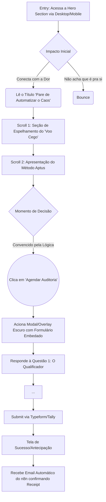
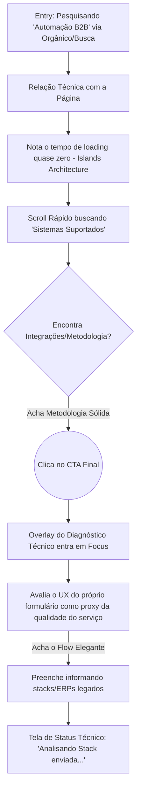

# UX Design Specification LandingPage

**Author:** Jonathas
**Date:** 2026-03-02

---

<!-- UX design content will be appended sequentially through collaborative workflow steps -->

## Executive Summary

### Project Vision

Uma Landing Page B2B SPA de performance extrema (Astro) projetada como um "Lead Qualification Engine". A interface atuará como um filtro implacável e magnético, atraindo líderes através de uma estética rigorosa, Premium e Dark Mode. O design comunicará o "Método Aptus" não como ferramentas ou bots, mas como Engenharia Operacional definitiva. O visual deve gerar profundo contraste entre o "Voo Cego" do caos atual da empresa do cliente e a ordem arquitetônica fluida que os sistemas da Aptus entregam.

### Target Users

- **O Fundador Sobrecaregado (Marcelo):** CEO de PME que vive apagando incêndios, frustrado com a falta de previsibilidade, procurando soluções confiáveis e definitivas (livres de erro) para descansar e focar na estratégia. O UX precisa transmitir a ele segurança, conforto e alívio imediato.
- **Líder de Operações Escaláveis (Carla):** COO/Diretoria com foco racional em eficiência. Vai analisar a página tecnicamente; logo, interações limpas, carregamento instantâneo e ausência total de "UI quebrada" são fundamentais para transmitir senioridade tecnológica.

### Key Design Challenges

- **O Distanciamento do "AI Slop":** É um grande desafio evitar elementos visuais genéricos de "agência de IA" (como os famosos tons neon, roxos gradientes e layouts amadores de templates prontos) ao mesmo tempo que vendemos a modernidade de processos com n8n e Vibecoding.
- **"Fricção Positiva" na Conversão:** O formulário de captura é denso (uma aplicação para auditoria). O desafio é embutir o Typeform/Tally de maneira que o usuário não se sinta cansado, e sim sinta que está preenchendo algo valioso e consultivo.
- **Velocidade Extrema com Interface Sofisticada:** Entregar todas as animações e o peso visual sofisticado exigidos sem sacrificar os Core Web Vitals (a meta é Lighthouse >= 95), exigindo design limpo e renderização assíncrona perfeita.

### Design Opportunities

- **A Estética da "Engenharia Silenciosa":** Oportunidade perfeita de aplicar um design minimalista brutal ou maximalismo sob total controle — muitas áreas respirando, tipografia elegante e interativa (para contrastar com ferramentas de massa), provando que Aptus é uma "boutique tecnológica".
- **Transições "Arquitetônicas":** Uso de scroll-trigger e micro-animações CSS nativas que revelem as seções simulando "processos tomando ordem", refletindo sutilmente o que a automação faz pelos negócios dos clientes.

## Core User Experience

### Defining Experience

A experiência central orbita ao redor de uma **"Jornada de Espelhamento e Diagnóstico"**. O usuário (CEO/COO) navega verticalmente por uma narrativa que primeiro o "golpea" de forma empática relatando exatamente as dores do seu caos operacional diário (o "Voo Cego"). Ao sentir que o problema foi diagnosticado perfeitamente, a experiência imediatamente apresenta a "Engenharia Operacional com Vibecoding" como antídoto. **A ação principal absoluta** é o engajamento e preenchimento fluido de um formulário longo e denso, feito não para ser "rápido", mas para ser percebido como a primeira etapa de uma valiosa consultoria arquitetônica.

### Platform Strategy

- **Web First (SPA via Astro):** A aplicação será acessada predominantemente via Desktop (por líderes em horário de trabalho ou analisando soluções no escritório) e Mobile (navegação noturna de fundadores em busca de soluções).
- **Sem Interrupções de Carregamento:** O uso da Islands Architecture do Astro garantirá que a "casca" pesada e estilizada da página carregue instantaneamente, enquanto o peso dos scripts de terceiros (como o Typeform) seja adiado (Lazy Loaded on interact) para evitar travamentos ou scores baixos no Lighthouse.

### Effortless Interactions

- **Scroll e Revelação de Conteúdo:** O escaneamento da página (scroll) deve parecer cinematográfico sem ser pesado. O surgimento dos textos de dor deve ser suave.
- **Transição CTA -> Formulário:** O clique no botão "Agendar Auditoria" não deve jogar o usuário para outra aba feia ou demorada, mas acionar o formulário embedado na mesma viewport de forma elegante (como um modal escuro de preenchimento em tela cheia na própria página), mantendo-o imerso no ambiente Premium.

### Critical Success Moments

- **Os 3 Primeiros Segundos (O Choque):** O herói da página carregando instantaneamente e a leitura do título "Pare de Automatizar o Caos" deve criar uma conexão empática fulminante. Se demorar, ele pula; se parecer genérico, ele acha que é mais uma "agência de botinha".
- **A Virada de Chave (O Alívio):** O momento na rolagem em que ele visualiza o gráfico simples ou o fluxograma de "Como os Sistemas Aptus Operam Invisivelmente".

### Experience Principles

- **Densidade Intencional (Carga Cognitiva Útil):** Em vez de simplificarmos demais, usaremos jargões de negócio controlados e informações maduras para filtrar Leads curiosos e instigar decisores maduros.
- **Autoridade Silenciosa, Nunca Escandalosa:** Evitará banners com "Compre Agora", adotando CTA's elegantes como "Solicite uma Auditoria da sua Arquitetura".
- **Fricção como Qualificação:** O formulário tem muitas perguntas obrigatoriamente — e isso é proposital. A experiência do Typeform/Tally precisa fluir perfeitamente (uma pergunta por tela), transformando atrito em um processo de catarse para o cliente reclamar de seu próprio caos.

## Desired Emotional Response

### Primary Emotional Goals

- **Alívio Profundo ("Relief"):** A sensação de que um peso gigante ("O Voo Cego") está prestes a ser retirado de seus ombros corporativos.
- **Confiança Institucional ("Trust"):** A certeza de estar lidando com especialistas seniores em Engenharia Operacional que tratam a causa raiz, e não aventureiros que vendem "bots" paliativos.
- **Curiosidade e Fascínio ("Awe"):** Compreender a elegância de sistemas invisíveis e agentes autônomos governando processos caóticos.

### Emotional Journey Mapping

- **Momento da Descoberta (Hero Section):** *Choque Empático*. Ao ler a headline ("Pare de Automatizar o Caos") em um ambiente visual escuro e Premium, o CEO sente-se profundamente compreendido. "Eles sabem exatamente o que estou passando".
- **Fase de Exploração (Método Aptus):** *Validação Racional e Fascínio*. A frustração inicial é trocada pela compreensão de que existe um método arquitetônico (Auditoria > Arquitetura > Deploy) seguro para resolver problemas sistêmicos.
- **Interação Crítica (Preenchimento do Typeform):** *Comprometimento Sério*. O usuário não sente que está apenas "mandando um e-mail", mas sim investindo ativamente os primeiros minutos na transformação de sua empresa (Fricção Qualificada).
- **Pós-Ação (Success State):** *Antecipação Guiada*. Certeza de que as engrenagens já começaram a se mover e sua empresa está prestes a subir de nível estrutural.

### Micro-Emotions

- **Confiança vs. Ceticismo:** Vencer o natural ceticismo do líder através de um design que evite superlativos marqueteiros baratos. A interface deve comunicar solidez financeira e técnica.
- **Foco Absoluto vs. Distração Cognitiva:** A página não terá 15 abas ou links que distraiam a leitura (sem vazamentos de fluxo). Isso induz um sentimento de direção rigorosa.
- **Elegância vs. Frivolidade "Web3":** Eliminação de efeitos exageradamente "tech". Movimentos lentos, opacidades delicadas e tipografia sofisticada geram o sentimento de um "escritório de consultoria <i>high-end</i>", não um software barato.

### Design Implications

- **Se queremos criar Confiança, o UX deve ser:** Austero e limpo. Uso do esquema *Dark Theme*, com bordas nítidas e uma paleta rigorosamente mantida, remetendo ao mundo B2B corporativo seguro.
- **Se queremos criar Alívio, o UX deve ser:** Orientado. A leitura em forma de 'Z' e 'F' deve ser fácil. A página deve ter bastante espaço negativo (respiro) para combater a sensação de asfixia processual do cliente.
- **Se queremos gerar Confiança no Formulário, o UX deve ser:** Linear e à prova de erros. O modal do formulário deve ser centralizado e imersivo, bloqueando distrações externas.

### Emotional Design Principles

1. **Empatia antes da Tecnologia:** O "espelho da dor" visual e escrito vem antes da palavra "IA" ou "Vibecoding". A emoção do alívio precede a lógica do código.
2. **Minimalismo Intencional:** Remover tudo que não adiciona valor estrutural à comunicação. Menos elementos geram a percepção emocional de um produto premium e focado.

## UX Pattern Analysis & Inspiration

### Inspiring Products Analysis

Para alcançar o nível de Confiança (Trust) e Fascínio (Awe) que buscamos, nossa inspiração estética e de UX deriva de plataformas de engenharia de elite e finanças globais:

1. **Linear (Gestão de Projetos B2B):**
   - *Por que funciona:* Estética sombria (Dark Mode nativo), tipografia implacável, bordas finas e micro-interações instantâneas. Eles vendem "foco e alinhamento" através de uma UI que parece um software tático de alta performance, não um app para equipes de marketing.
2. **Vercel / Next.js (Ecossistema de Deploy):**
   - *Por que funciona:* Comunica velocidade extrema ("ship it"). Uso sublime de contrastes severos, minimalismo com intenção e arquitetura da informação voltada ao desenvolvedor/líder técnico, o que remete automaticamente à senioridade.
3. **Stripe (Pagamentos / Infraestrutura):**
   - *Por que funciona:* A referência absoluta na conversão de B2B e confiança de engenharia. Formulários impecáveis, validação em tempo real e documentações que parecem revistas de design editorial.

### Transferable UX Patterns

**Padrões Visuais:**
- *Modo Noturno (Dark UI) Profundo:* Fundos em "True Black" (`#000000`) ou "Off-Black" (`#0a0a0a`) texturizados sutilmente (ruído/grain) para profundidade luxuosa (inspirado no Linear).
- *Tipografia de Alta Precisão:* Uso de fontes Sans-Serif Neogrotescas modernas (ex: Inter, Geist, ou Helvetica Now) combinadas com fontes Monoespaçadas (ex: JetBrains Mono) para dados técnicos/códigos, reforçando que somos "Engenharia".

**Padrões de Interação (Formulários & Scroll):**
- *Scroll Cinemático / Sticky Sections:* Conforme o usuário rola, a "dor" do processo se desenrola suavemente, semelhante às páginas de lançamento da Apple, prendendo a atenção na leitura.
- *Micro-Formulários Progressivos (Padrão Typeform):* Interface livre de distrações; o usuário preenche um dado denso por vez com submissão suave (tecla Enter avança), similar ao onboarding premium de startups B2B.

### Anti-Patterns to Avoid

- **A Estética "AI Startups":** Uso de roxos e azuis neon gritantes, gradientes excessivos, botões brilhantes e avatares robóticos genéricos. Isso nos deixaria parecidos com vendedores de "bots de WhatsApp" baratos.
- **Painéis de Preços Clássicos (SaaS 3-colunas):** Porque vendemos projetos arquitetônicos qualificados, e não planos fixos P/M/G de prateleira.
- **Floating Chatbots Intrusivos:** Aquele widget de bot no canto inferior direito que abre automaticamente ("Como posso ajudar?") prejudica o sentimento de calma e consultoria madura. A qualificação tem que ser passiva e provocativa, não interruptiva.
- **Páginas Excessivamente Coloridas ou com "Ilustrações de Bonequinhos" (Corporate Memphis):** Esse estilo (muito comum em HR techs) destrói a premissa de um serviço rigoroso e implacável para resolver operações pesadas.

### Design Inspiration Strategy

**What to Adopt (Adotar fortemente):**
- A tipografia, as linhas de grid finas (bordas com opacidade de 10%) e o layout estruturado horizontal/vertical que lembra uma IDE (ambiente de desenvolvimento), criando a ilusão de engenharia pura em quem não programa.

**What to Adapt (Adaptar):**
- O fluxo dos formulários imersivos (estilo Stripe Onboarding) para a captação do Diagnóstico Inicial profundo.

**What to Avoid (Evitar a todo custo):**
- Textos longos justificados e componentes da web tradicionais e sem graça. Se o cliente vai preencher um diagnóstico imenso, a interface (CTAs, Inputs) deve dar *prazer tátil visual* ao ser clicada.

## Design System Foundation

### 1.1 Design System Choice

**Tailwind CSS (como Utility-First Foundation) + Tailwind Variants + Componentes Headless leves.**

*Nota Técnica:* Como usaremos Astro (Islands Architecture), a abordagem será criar nossos próprios componentes (um "Custom Design System" enxuto sob demanda), utilizando o Tailwind CSS para estilização tática ao invés de importar uma biblioteca de terceiros pesada (como Material UI ou Bootstrap).

### Rationale for Selection

- **Velocidade de Carregamento (Performance 95+):** Bibliotecas prontas costumam carregar muito JavaScript não utilizado. O Tailwind compila apenas as classes CSS que realmente usamos (via PurgeCSS embutido), garantindo aquele tempo de renderização em `< 2.0s` exigido no nosso PRD.
- **Vibecoding Friendly:** LLMs e agentes de código lidam maravilhosamente bem com o Tailwind CSS, o que permite prototipação ágil mantendo fidelidade estrita às ordens visuais.
- **Controle Estético Absoluto:** Sistemas estabelecidos (como Ant Design) lutam contra nós quando tentamos criar um Dark Mode profundo com texturas luxuosas. Tailwind não tem opinião forte, sendo apenas o motor para criarmos as interações cinemáticas que precisamos.

### Implementation Approach

1. **Setup Centralizado no `tailwind.config.mjs`:** Toda a paleta de cores (Os "True Blacks", os tons sutis de borda cinza `zinc-800` a `zinc-900`) e a tipografia inter/mono serão definidos na raiz. Nenhuma cor hard-coded no HTML.
2. **Arquitetura Zero-JS-First (Astro Islands):** O design será montado 90% em CSS/HTML puros renderizados no servidor através do Astro. JavaScript de interface só será "hidratado" na pequena porção de tela em que o usuário precisar interagir (como abrir o modal do Typeform).

### Customization Strategy

- **Design Tokens Mínimos:** Em vez de dezenas de cores primárias/secundárias brandas, focaremos em opacidades. Usaremos a escala de cores padrão para fundos escuros (ex: Zinc ou Slate do Tailwind), adicionando apenas uma cor de sotaque (Accent Color) super incisiva (como um azul elétrico ou verde neon fosco) reservada *apenas* para CTAs e elementos on-hover.
- **Animações (Micro-interações):** As animações (o "reveal" do scroll) não usarão bibliotecas JS pesadas (Framer Motion ou GSAP), mas sim os recursos modernos nativos de CSS e as utilities de `@apply` personalizadas no Tailwind para preservar o budget de performance.

## 2. Core User Experience

### 2.1 Defining Experience

A interação principal ("The Defining Experience") da Landing Page não é apenas "rolar a página", mas sim a **Transição da Dor para a Solução via Formulário**. É o momento em que o visitante lê a provocação principal, decide clicar em "Agendar Auditoria" e, ao invés de ser redirecionado para um formulário "Fale Conosco" genérico de de 3 campos, ele é imerso em um Questionário Tático (Typeform/Tally) que conversa diretamente sobre os gargalos operacionais dele. Se a primeira pergunta do form ressoar fortemente, ele irá preencher as próximas cinco sem hesitar. 

### 2.2 User Mental Model

- **Modelo Atual Frustrante:** Hoje, quando esse executivo procura soluções, o padrão (mental model) dele é: tentar pedir um orçamento, falar com um vendedor júnior que não entende sua operação, e receber uma proposta padrão em PDF.
- **Quebra do Modelo:** O usuário espera que a Aptus tente vender algo de cara. Em vez disso, o UX o obriga a passar por um raio-x inicial.
- **Expectativa Modificada:** Durante os passos da página e do formulário, a percepção mental muda de "Estou comprando um bot" para "Aptus está diagnosticando se eles podem salvar minha empresa". 

### 2.3 Success Criteria

A experiência do Diagnóstico será considerada sublime se atender aos seguintes indicadores:

- **Imersão Imediata (Zero Fricção Visual):** O modal ou interface do formulário de diagnóstico ativa-se imediatamente sem loading screens ou recarregamento total da página web (graças ao JS assíncrono).
- **Alinhamento Progressivo:** Cada pergunta apresentada ("Quantas ferramentas você usa hoje que não conversam entre si?") serve para balançar a cabeça do decisor, afirmando "sim, esse é o meu problema".
- **Taxa de Término Elevada:** O design deve encorajar o fechamento do ticket. Um fluxo que guia com foco (uma questão grande por visualização, auto-progressão on press 'Enter') contra o desânimo de uma tela branca com 10 "text areas" vazias.

### 2.4 Novel UX Patterns

**O Formulário como "Landing Page Pt. 2":**
Em vez do formulário ser o "fim" abandonado da experiência de usuário, ele é construído utilizando o conceito de *Conversational UI Layout*. Usaremos um padrão estabelecido pelas startups premium (One-field per view UX), mas inovaremos garantindo que o copy do formulário contenha micro-feedbacks estratégicos do Método Aptus à medida que ele preenche.

### 2.5 Experience Mechanics

1. **Initiation (Iniciação):** Conforme o usuário faz escaneamento vertical, CTAs discretos (porém constrastantes) o convidam para "Solicitar Auditoria Estrutural". A ação é ativada via click (Desktop) ou OnTab (Mobile).
2. **Interaction (Interação):** A interface da Landing Page é obscurecida sutilmente, e o painel do Diagnóstico toma o espaço central. O usuário interage com opções de múltipla escolha ou teclado, focado inteiramente na tarefa corrente.
3. **Feedback (Resposta):** Micro-animações nativas acompanham a verificação (checkmarks verdes elegantes após validação dos e-mails corporativos, transições sutis em Y-axis para a próxima pergunta).
4. **Completion (Conclusão):** O usuário submete. A tela de envio não apresenta um mero "Obrigado". Em vez disso, apresenta um roteiro do que acontece agora: "Analisando seu ecossistema... Seu perfil foi enviado ao núcleo de Engenharia Aptus. Tempo de resposta projetado: 24h úteis." (Isto cimenta a autoridade e previsibilidade prometidas).

## Visual Design Foundation

### Color System

A paleta de cores rejeita o branco corporativo e os gradientes infantis, abraçando um **Modo Noturno Autêntico** que transmite senioridade tática:

- **Background Principal (`bg-zinc-950`):** Preto quase puro (`#09090b`), criando profundidade infinita.
- **Backgrounds Secundários (`bg-zinc-900` a `bg-zinc-800`):** Para cartões, modais (como o do formulário) e seções de destaque sutis.
- **Bordas e Divisores (`border-zinc-800/50`):** Linhas muito finas (1px) quase translúcidas, formando o "grid da engenharia" sem poluir a visão.
- **Accent Color (Cor de Sotaque):** Um único tom vibrante. Recomenda-se um verde tecnológico elétrico (`#10b981` ou Emerald) ou um azul neon muito pálido (`#38bdf8` ou Sky). Essa cor só deve aparecer em: CTAs primários (botão "Agendar Auditoria"), hover states críticos e nos sucessos de validação do formulário. A raridade da sua aplicação a torna poderosa.

### Typography System

O contraste tipográfico sustentará a "Alegoria da Engenharia". Usaremos tipografia sem serifa para a voz corporativa e uma monoespaçada para componentes técnicos (Data points/Metrics).

- **Primary Font (Headings & Venda):** *Inter* ou *Geist Sans*. Focadas em extrema legibilidade. Títulos (H1, H2) devem ser renderizados com peso semibold (600) a bold (700) e `tracking-tight` (letras mais juntas) para dar impacto coeso à headline.
- **Secondary Font (Apoio & Dados):** *Geist Mono* ou *JetBrains Mono*. Ocasionalmente aplicadas em badgets, numerações de passo-a-passo (01, 02) ou contadores de status. Reafirma visualmente o tema "Engenharia".
- **Coloração do Texto:** O texto principal nunca é 100% branco (para não ferir os olhos no fundo preto). Títulos usam `text-zinc-100` (`#f4f4f5`) e textos de corpo `text-zinc-400` (`#a1a1aa`).

### Spacing & Layout Foundation

- **Densidade Controlada:** O estilo não deve ser esmagado. O espaço negativo ("breathing room") é mandatório. Uma margem/padding padrão muito generoso entre seções (ex: `py-24` ou `py-32` no Tailwind) deve ser adotado.
- **Alinhamentos Rígidos:** Margens esquerdas e direitas devem manter uma linha invisível inquebrável (Máximo de `max-w-7xl`). Sem layouts de "zigue-zague" desorganizados.
- **Container do Formulário:** O form central de captação deve herdar um `max-w-2xl` máximo no desktop, centralizado perfeitamente (`mx-auto`), limitando o comprimento da linha de visão do CEO para aumentar o foco e reduzir a fadiga de leitura na hora de reclamar de suas dores operacionais.

### Accessibility Considerations

- Todo o texto descritivo e placeholders do formulário estarão dentro das normas de contraste AA em telas escuras (min 4.5:1).
- Toda as opções de inputs interativos (botões de múltipla-escolha do Typeform/Tally) deverão ter focus-states delineados (anéis e bordas resplandecentes ao navegar via tecla Tab), o que confere uso de teclado perfeito "Keyboard First", muito apreciado por líderes de operação que dispensam o mouse.

## Design Direction Decision

### Design Directions Explored

Foram geradas e analisadas 4 abordagens distintas de design baseadas na fundação '*Dark Mode Corporativo*':
1. **O Brutalismo Estrutural (Inspirado no Linear):** Foco massivo em organização de grid, bordas rígidas de 1px e hierarquia arquitetônica matemática.
2. **Minimalismo Etéreo (Inspirado no Vercel):** Foco extremo no espaço negativo ("o vácuo") e no peso centralizado do conteúdo com gradientes escuros e brandos simluando luz de background.
3. **O Terminal (Code-First):** Uma interpretação literal e visual de "Engenharia Operacional" usando *prompts* e janelas no estilo Terminal (`.sh`) para engajar diretores de tecnologia (COOs e CTOs).
4. **Consultoria High-End:** Linhas tipográficas finas, grids horizontais esparsos e linguagem de design voltada para "Relatórios de Status de Wall Street" e grandes auditorias tradicionais.

### Chosen Direction

**A Decisão:** Criaremos uma convergência inteligente entre a **Direção 1 (Brutalismo Estrutural / Linear Style)** e a **Direção 2 (Minimalismo Etéreo)**.
O resultado é o nosso design visual definitivo: **Luxo Operacional B2B.**

**Key Elements:**
- A clareza espacial (espaço negativo imenso) e os fundos de "luz de blur/mesh" sutis do Minimalismo manterão a atenção cravada na headline.
- O rigor (grids visíveis pálidos, tipografia `Inter` austera, caixas em stroke de 1px `border-zinc-800`) do Brutalismo Estrutural garantirá a "Senioridade e Transparência".
- A *Accent Color* (Cor de Destaque) será um Emerald (Verde Elétrico) mas usado de forma ultra-controlada e minimalista apenas em badges e feedbacks pontuais.

### Design Rationale

O executivo sobrecarregado ("Marcelo") precisa entender num piscar de olhos que a Aptus *não é* um mar de teoria colorida. As bordas finas e o layout matemático passam a ideia de **Ordem e Governança** (aliviando a dor do seu Voo Cego). Contudo, incorporar os grandes espaços negativos e sutilezas de luz centraliza a atenção no Formulário de Diagnóstico sem sufocar o usuário cognitivamente, separando-nos da poluição visual dos concorrentes diretos (agências tradicionais).

### Implementation Approach

- O setup da paleta no TailwindCSS será focado exclusivamente em estender as gamas do `Zinc` nativo e do preto, forçando a consistência.
- Desenvolveremos uma utilidade no Tailwind para o painel translúcido central (efeito `backdrop-blur` do *Mac OS* misturado com painéis corporativos) onde repousará o nosso modal de formulário.
- Componentes não terão "sombras macias" tradicionais (box-shadow suaves). Usaremos fundos puramente opacos e strokes hiper-finos para contraste duro, passando solidez. Modais aparecerão instantaneamente para reforçar velocidade.

## User Journey Flows

### Jornada 1: A Catarse do "Voo Cego" (Primary User: Founder)

O fluxo desenhado para quem chegou por indicação ou anúncio e sente a dor descrita, precisando de certeza emocional antes de preencher um formulário longo.

### Jornada 2: A Validação do COO (Secondary User)

A Jornada para os perfis técnicos e de operações (Carla) que entram validando não apenas as promessas de copy, mas como o site se comporta, buscando provas de que a solução integra com o que já possuem e entendendo a "velocidade" da Landing Page.

### Journey Patterns

- **Início Passivo, Conclusão Ativa (Progressive Commitment):** A página exige nada nos primeiros 75% da altura. Sem pop-ups ou links piscando. O engajamento constrói até o *cliffhanger* (CTA), quando a interface vira ativamente um *Command Center* para captar os dados do usuário.
- **Scroll = Storytelling Ininterrupto:** O usuário nunca troca de página HTML (`href="page2.html"`). Toda o aprendizado emocional e arquitetônico ocorre verticalmente em uma SPA (Single Page Application) ou com modais fluídas. Quando algo precisa de atenção (o Formulário), o background afasta-se para as sombras (`backdrop-blur`).
- **One Field Per Screen (Form UI):** A experiência da conversão será estritamente de "uma pergunta por vez". Em dispositivos Desktop, o envio é por atalhos de teclado (Enter).

### Flow Optimization Principles

- **Focus Lock (Bloqueio Cognitivo):** Durante o "Agendar Auditoria", os cabeçalhos de navegação e as informações extras da Landing Page não devem estar visíveis. O usuário tem apenas 2 ações: Continuar detalhando seu caos, ou usar o botão "X" para abortar a solicitação (e provar que não está qualificado).
- **Antecipação Tática vs. Omissão Genérica:** Em vez de telas vazias ("Loading..."), usaremos mensagens ricas durante processamentos (Ex: "Roteando para engenheiro especialista..." após a coleta dos dados do usuário).

## UX Consistency Patterns

### Button Hierarchy

O comportamento e a aparência dos botões devem sinalizar silenciosamente sua importância, para evitar a fadiga de decisão ("Paradoxo da Escolha"):

- **Ação Primária Estrita (Primary Action):** Usado *apenas* para o CTA de Conversão ("Agendar Auditoria"). Estilo: Full opacity, bordas sólidas, e Accent Color (Verde Elétrico) ativa nos interactions-states (`hover:border-emerald-500 hover:text-emerald-400`).
- **Ações Secundárias (Secondary Action):** Links para seções internas (Ex: "Como funciona o método?") ou links de rodapé. Estilo: Ghost Buttons (sem fundo), texto sutil (`text-zinc-400`), que revelam um fundo muito escuro (`hover:bg-zinc-900`) e texto claro (`hover:text-zinc-100`) apenas no hover.
- **Micro-Interactions (O Padrão de Animação):** Todos os botões terão transições CSS super curtas (150ms a 200ms `duration-200`) e curva de easing contida (`ease-out`), sem animações dramáticas elásticas para manter o "vibe" corporativo rigoroso.

### Feedback Patterns

O executivo que visita a página não tem tempo para errar. E se errar (ao preencher o formulário), o aviso não pode parecer que um alarme de incêndio tocou.

- **Success States (Sucesso):** O padrão é uma mudança sutil de estado (um checkmark delicado aparecendo, ou a borda do input do Tally/Typeform brilhando verde suave). Nunca usaremos confetes na tela ou janelas pop-up invasivas.
- **Error States (Erros de Validação):** Se o usuário esquecer o e-mail no form, o input ganha uma borda vermelha apagada (`border-red-900/50`) e um texto auxiliar minúsculo surge colado na parte inferior do input ("Favor inserir um e-mail corporativo"). A linha nunca salta desordenando o layout (Positioning absoluto ou reservando via min-height do container pai).

### Form Patterns

A conversão ocorre no formulário embedado, portanto seu padrão é o núcleo vivo da conversão.

- **One Action per Time:** Jamais exibir dezenas de campos soltos. Abordagem paginada (estilo Typeform).
- **Sem Auto-Advance Agressivo:** Ao selecionar uma opção de múltipla escolha ou preencher um input de texto, o formulário exibirá discretamente uma instrução "Pressione Enter ↵ para continuar", mantendo o usuário no controle total.
- **Clear Placeholders:** Campos de texto sempre devem vir com um valor genérico exemplificado (e.g. `marcelo@suaempresa.com.br`) que some assim que há `focus`.

### Navigation Patterns

- **Minimalismo de Cabeçalho (Header):** Aptus não usa um "Megamenu" corporativo tradicional cheio de serviços irrelevantes. O Header contém apenas o logo em SVGs monocromáticos à esquerda (para brand awareness precoce) e o botão Primário (Tactical CTA) à direita (ou centralizado no mobile). Não há navegação "Sobre nós", "Blog" na primeira dobra para evitar fugas cognitivas.
- **Sticky Footer (Navegação Pós-Análise):** Todos os links secundários (Políticas, Contato, Redes Sociais) ficam estritamente no Footer, agindo como a rede de segurança para quem rolou a SPA inteira e precisa de legitimação institucional final.

### Additional Patterns (Typography & Pacing)

- **Reading Pacing (Ritmo de Leitura):** Grandes blocos de texto são banidos. O padrão para leitura na landing page é H2 (Headline) acompanhado de não mais do que 3 linhas de texto base (`
`). Tudo que for mais denso será formatado como "Bullet-points com ícones de validação técnica" (checkmarks ou setas).

## Responsive Design & Accessibility

### Responsive Strategy

Em vez de focar numa abordagem "Mobile-First" tradicional de e-commerce, adotaremos a tática de **"Content-First Fluidity"**. 

- **Desktop (O Foco Primário):** A tela grande é o palco principal da Engenharia Aptus. Aqui usaremos a amplitude para aplicar nossos grandes grids pálidos, margins laterais generosíssimas para acalmar a visão (`mx-auto max-w-7xl` e grandes `gap` estruturais).
- **Mobile (O Scroller de Descoberta):** Os CEOs leem as headlines no trânsito. O Mobile não pode parecer um "desktop apertado". Textos devem ter saltos de tamanho (`text-3xl` max), alinhamento estrito à esquerda para rápida leitura, e os botões devem ser `w-full` ancorados estrategicamente na tela.

### Breakpoint Strategy

Utilizaremos o sistema padrão do Tailwind CSS, ideal para manter a conveniência de manutenção do código:
- `sm` (640px) e abaixo: **Mobile UI.** (Stacks verticais totais, padding lateral de `px-4`).
- `md` (768px): **Tablet Portrait.** (Padding relaxado para `px-8`, começo do grid de 2 colunas para informações de apoio).
- `lg` (1024px) e `xl` (1280px): **Desktop UI.** (Ativação total da UI baseada em linhas técnicas do Brutalismo Estrutural, painéis laterais fixos se houver necessidade).

### Accessibility Strategy

A prioridade aqui é garantir que o design suporte executivos em ambientes de alta luminosidade e com fadiga visual (e cumprir requisitos corporativos de nível **WCAG 2.1 AA**):

- **Contraste Rígido:** A paleta `Zinc` do Tailwind já provê contrastes estudados nativamente (ex: `text-zinc-100` em `bg-zinc-950` bate taxas > 15:1 de contraste).
- **Sem Hover Exclusivo:** Nenhuma informação crítica pode existir APENAS em hover, porque usuários mobile não tem "mouse hover".
- **Focus Rings:** O foco via teclado nas opções de múltipla escolha ou botão "Agendar Auditoria" nunca pode ser a linha tracejada feia padrão do browser. Usaremos `focus-visible:ring-2 focus-visible:ring-emerald-500` para desenhar um halo verde brilhante que prova nossa atenção aos detalhes para o COO técnico testando nossa UX.

### Testing Strategy

- Usaremos extesões do Google Lighthouse (integrado diretamente no pipeline do Cloudflare Pages se possível) para garantir a trava no Score "Accessibility: 100".
- Usaremos o "axe DevTools" no navegador durante a codificação (Vibecoding) para barrar lançamento de código com elementos não-interativos falhando critérios ARIA.

### Implementation Guidelines

Para o dev (nós/Vibecodding) que irá construir isso:
- O formulário Typeform/Tally *tem* que ser injetado de maneira "Responsive-Iframe-Ready", ou renderizado nativamente sem quebrar a largura miníma de 320px do smartphone (causando aquele scroll lateral horrível).
- Animações baseadas em scroll (como revelar os blocos de dor) devem respeitar a query `@media (prefers-reduced-motion: reduce)`, desligando transições se o sistema operacional do usuário pedir - um detalhe ínfimo, mas que atesta purismo na Engenharia de Software.

## Component Strategy

### Design System Components (Tailwind Foundation)

Como a nossa escolha de base foi puramente TailwindCSS, não teremos componentes pré-fabricados (como um `<Card>` com estilos hardcoded importado). Em vez disso, usaremos "Utility Tokens" padronizados no Tailwind e construiremos os componentes no Astro (`.astro` components) garantindo máxima performance.

**Componentes base estruturados via Tailwind Variants:**
- Typography Headers (H1, H2, H3 pautando tracking e leading)
- Grid Containers (max-w, paddings de sessão)

### Custom Components

Precisaremos de um conjunto muito enxuto, seleto, e perfeitamente executado de componentes customizados:

#### 1. The Tactical CTA (Button)
**Purpose:** O condutor principal de conversão ("Agendar Auditoria").
**Anatomy:** Texto em caixa alta com tracking (`tracking-wider`), ícone sutil de seta direita (`ChevronRight`) que translada no hover, e borda de 1px com glow sutil interno.
**States:** Default (borda zinc-700, texto zinc-300), Hover (borda Emerald-500/50, fundo Emerald-500/10, texto Emerald-400), Disabled (opacidade 50%).
**Interaction Behavior:** Clique instantâneo sem delay de animação.

#### 2. Diagnostic Modal (Diagnostic Container)
**Purpose:** O "Espelho Oculto" onde o Typeform/Tally viverá.
**Usage:** Disparado ao clicar the Tactical CTA ou via "Intenção de Saída" (Exit Intent).
**Anatomy:** Uma div que ocupa 100vh/100vw com `backdrop-blur-xl` e `bg-zinc-950/80` com um botão (X) absoluto no topo direito. O formulário repousa centralizado usando `max-w-xl`.
**Interaction Behavior:** Desliza sutilmente do bottom-up (`translate-y`) enquanto a opacidade do fundo escurece. Para travar o usuário, o evento de `scroll` do body é desativado ("Focus Lock").

#### 3. Data Matrix Badge (Metric Component)
**Purpose:** Exibir números e estatísticas ao longo do copy sem recorrer a gráficos pie/bar genéricos.
**Anatomy:** Font Monoespaçada (`JetBrains Mono`), tipicamente prefixada por um sinal de "Maior que" (`>`) ou ponto piscante imitando um terminal.
**Usage:** Na seção "Apresentação da Solução Aptus" para atestar resultados quantificáveis.

### Component Implementation Strategy

- **Arquitetura `.astro`:** A maior parte dos componentes citados será criada como arquivos estáticos do framework (ex: `Button.astro`, `Badge.astro`).
- **Zero-JS by Default:** Componentes visuais como Badges não terão nenhum JS atrelado, garantindo o LCP (Largest Contentful Paint) imediato e o perfeito score no Lighthouse. O JS será atrelado unicamente e reativamente ('Astro Islands') no botão que invoca o `Diagnostic Modal`.
- **Acessibilidade Embutida (A11y):** Todos os componentes terão regras duras de `aria-labels` e navegação via "TAB" indexada corretamente (especialmente focando em quem for preencher o formulário usando apenas teclado na mesa do escritório).

### Implementation Roadmap

**Phase 1 - Estrutura Core (Sprint de Layout):**
- Layout Base e Typography Tokens (Tailwind Config)
- The Tactical CTA (O botão de Conversão)
- Container Wrappers (Grids/Max-Widths)

**Phase 2 - Mecanismo de Conversão (Integration Sprint):**
- Diagnostic Modal (Engenharia do backdrop-blur e focus lock)
- Embed do Tally/Typeform 

**Phase 3 - Refinos de Status (Polish Sprint):**
- Data Matrix Badges e pequenos micro-feedbacks em blocos de texto.
- Micro-Animações no Scroll (FadeIn Up usando classes tailwind `opacity-0` baseadas em `IntersectionObserver`).
